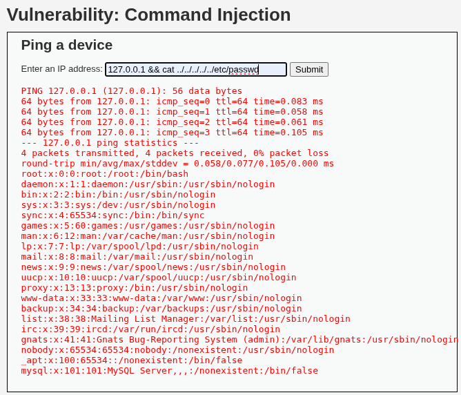
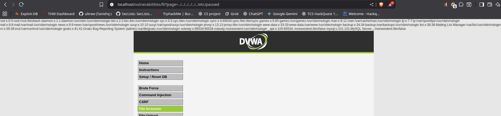
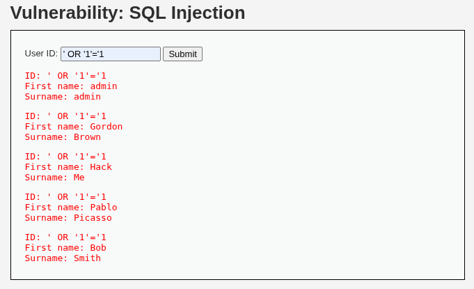
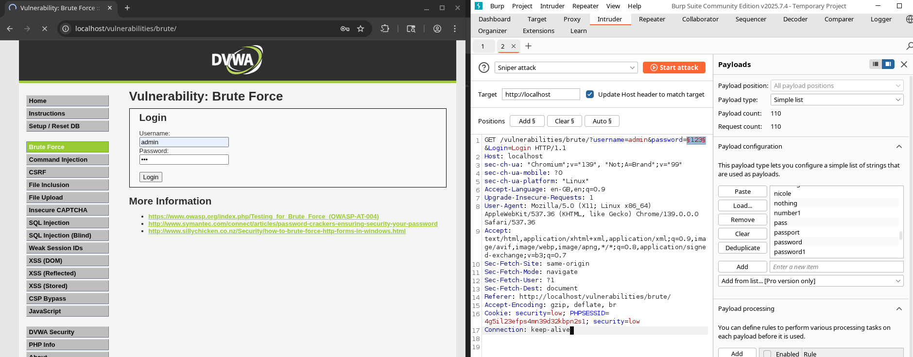
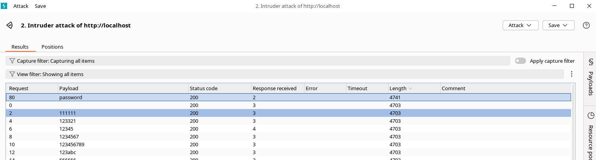
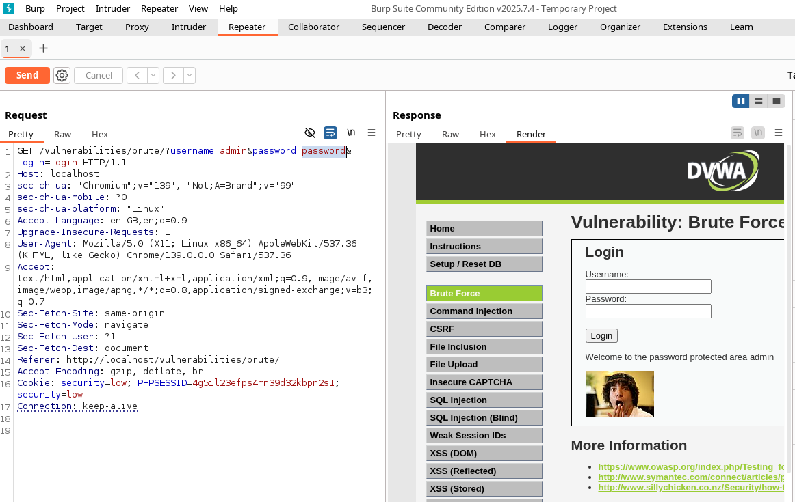

# Internship Report — Task1 [Web Application Vulnerability Testing]

**Intern:** [Tanishq Nama]

**Internship:** [Broskieshub.com]

**Environment:** Kali Linux (host), DVWA v1.10, Burp Suite, Browser: Brave.

---

## 1. Executive Summary

I conducted a focused set of web application security tests against a controlled target (DVWA). My objective was to identify, exploit (in a lab environment), and document the following common vulnerabilities: **Command Injection**, **File Inclusion (LFI/RFI)**, **SQL Injection**, and **Authentication Brute-Force**. For each vulnerability I describe my approach, proof-of-concept (PoC) evidence (screenshots saved in `/Screenshots`), risk assessment, and recommended fixes. testing was performed on authorized systems and in a lab environment.

---

## 2. Objectives

1. Learn and demonstrate practical exploitation techniques for common web vulnerabilities.
2. Produce clear, reproducible documentation for each finding suitable for a GitHub repository.
3. Recommend concrete mitigations and verify fixes where possible.

---

## 3. Scope & Rules of Engagement

- **Scope:** Target:  (DVWA). Only the listed endpoints and services were tested.
- **Authorization:** I have explicit permission to test the target in the lab environment.
- **Tools used:** Kali Linux, Burp Suite, Brave browser.

---

## 4. Methodology

I followed a simple repeatable process for each vulnerability:

1. Reconnaissance — Identify entry points and inputs (forms, parameters etc).
2. Confirmatory Testing — Use safe tests to confirm the presence of a vulnerability.
3. Exploitation (PoC) — Generate a reproducible PoC that demonstrates impact. Capture screenshots.
4. Risk Assessment — Rate the severity and explain impact.
5. Remediation — Provide fixes, code examples.

---

## 5. Findings (Per-Vulnerability Sections)

> **Note:** Each vulnerability below follows the same sub-section pattern: *Overview*, *Target & Entry Point*, *Reproduction Steps (PoC)*, *Evidence (screenshots)*, *Impact / Risk*, *Root Cause*, *Fix / Mitigation.

### 5.1 Command Injection

**Overview —** I tested for command injection tab of DVWA.

**Target & Entry Point —** `[http://172.17.0.1:8080/vulnerabilities/exec/]`

**Reproduction Steps (PoC) —** 
1. I opened `Command Injection` tab of DVWA and saw a ping a device field.
2. I just entered 127.0.0.1 and it showed ping packets.
3. Then I used following payload :
``` sh
127.0.0.1 && cat ../../../../../etc/passwd 
```
4. BOOM! we got passwords and saved the screenshot as (Command_Injection.png)

**Evidence (screenshots/logs)**
- Response showing passwd data.
  


**Impact / Risk —** Remote command execution can lead to full system compromise, data exposure, or lateral movement. Severity: **High**.

**Root Cause —** Unsafe concatenation of user input into OS command execution functions without validation or escaping.

**Fix / Mitigation —** recommended fix:

- Avoid invoking shell commands with unsanitized user input. Use native libraries/APIs.
- If shell execution is unavoidable, strictly validate input against an allowlist and use functions that bypass the shell (e.g., `execv` family) with parameter arrays.
- Example (PHP) — *unsafe* vs *safer* patterns:

```php
// Unsafe
$host = $_GET['host'];
$cmd = "ping -c 4 " . $host;
$output = shell_exec($cmd);

// Safer (validate and escape)
$host = $_GET['host'];
if (!preg_match('/^[0-9a-zA-Z\.\-]+$/', $host)) {
    die('invalid host');
}
$escaped = escapeshellarg($host);
$output = shell_exec("ping -c 4 $escaped");
```

- Prefer native libraries for the required action (e.g., use `socket` or DNS libraries rather than running `ping`).

---

### 5.2 File Inclusion

**Overview —** I went to File inclusion vulnerabilities tab of DVWA and in url i tested my payload and got access to passwd file .

**Target & Entry Point —** `[http://172.17.0.1:8080/vulnerabilities/fi/?page=../../../../../../etc/passwd]` — parameter: `page=`

**Reproduction Steps (PoC)**
1. I supplied payloads like `?page=../../../../../../etc/passwd` to check local file access.

**Evidence (screenshots/logs)**
- Partial `/etc/passwd` content displayed.
 


**Impact / Risk —** LFI can leak sensitive files; combined with upload or log poisoning, it may lead to remote code execution. Severity: **High**.

**Root Cause —** Unsanitized file path handling and direct inclusion of user-supplied path segments.

**Fix / Mitigation —**
- Normalize and canonicalize file paths and restrict access to a safe directory (use chroot or a configured template directory).
- Block `..` sequences and disallow URL wrappers if not required.
- Example (PHP) — allowlist approach:

```php
$allowed_pages = ['home', 'about', 'contact'];
$page = $_GET['page'] ?? 'home';
if (!in_array($page, $allowed_pages)) {
    $page = '404';
}
include __DIR__ . '/pages/' . $page . '.php';
```

---

### 5.3 SQL Injection

**Overview —** In SQL injection tab i found a fields to find user allowing data retrieval from webapp.

**Target & Entry Point —** search field (`user id`).

**Reproduction Steps (PoC)**
1. I tested with simple payloads: `' OR '1'='1` and observed getting access to many user's data.

**Evidence (screenshot)**
- User data access.



**Impact / Risk —** Data leakage, authentication bypass, or in some cases remote code execution. Severity: **High/Medium** depending on exposure.

**Root Cause —** Direct concatenation of inputs into SQL queries without parameterized queries.

**Fix / Mitigation —**
- Use parameterized prepared statements or ORM query builders; never concatenate raw user input into SQL.
- Example (PHP PDO):

```php
$stmt = $pdo->prepare('SELECT id FROM users WHERE username = :u AND password = :p');
$stmt->execute([':u' => $username, ':p' => $password]);
```

---

### 5.4 Authentication Brute-Force

**Overview —** I tested the login endpoint for weak rate limiting and credential stuffing by using Burp Suite to perform a password-guessing sniper attack and then verified the working credential using repeter tab of burpsuit.

**Target & Entry Point —** Login form: `http://172.17.0.1:8080/vulnerabilities/brute/ with `username` and `password` fields.

**Reproduction Steps (PoC)**
- I captured a normal login request in Burp Suite Proxy during a legitimate login flow.
- Sent the captured request to **Intruder** in Burp Suite.
- Configured Intruder using the **Sniper** attack type, set the `password` parameter as the payload position, and loaded a focused [Pass_wordlist](Resources/pass_best110.txt) as the payload.
- Launched the Sniper attack and monitored responses for anomalies (response length, status, or distinctive body differences) that indicate a successful attempt.
- Identified a candidate password from Intruder that produced a noticeably different/successful response.
- Replayed the successful payload in **Repeater** to confirm — the Repeater response returned the authenticated page (dashboard/home content), demonstrating a successful login with the discovered password.
- Example flow: Proxy (capture) → Intruder (Sniper, wordlist) → identify promising candidate → Repeater (verify).
- During the attack window I observed repeated successful/200 responses and no account lockout or progressive throttling.

**Evidence (screenshots/logs)**
- Intruder with login request
  
- 
  
- Burpsuit showing brute force attack

- 

- Burp repeter showing successful login for admin:password

- 

**Impact / Risk —** Account takeover, especially for accounts with weak passwords or reused credentials. Severity: **Medium/High**.

**Root Cause —** No account lockout, lack of rate limiting, and no detection for repeated failed attempts.

**Fix / Mitigation —**
- Implement progressive delays or temporary account lockouts on failed attempts.
- Use multi-factor authentication (MFA) for privileged accounts.
- Add IP-based rate limiting and detection/alerting on suspicious activity.

---

## 8. Conclusion & Learnings

During this internship I deepened my practical knowledge of web vulnerabilities and secure coding practices. I practiced responsible disclosure, produced reproducible PoCs, and learned about recommended mitigations.

---

**References:**
- OWASP Top 10
- DVWA documentation
- Burp Suite docs

---

**End of report**.


