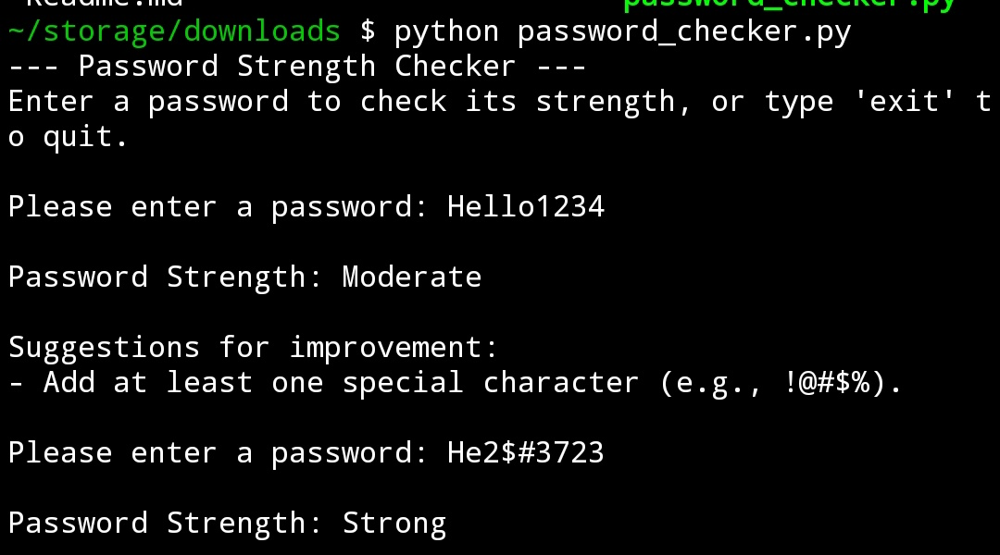

# Task-10 : Password Strength Analyzer

## Overview
In this project I develops a Python tool to evaluate password strength based on predefined rules, providing feedback to enhance security.

## Objective
- Build a Python-based password strength checker using specific criteria.

## Tools
- **Language**: Python
- **Module**: `re` for pattern matching
- **Environment**: Compatible with VS Code.

## Deliverables
- [Script](Evidence/password_checker.py): Python script for password analysis
- Input screenshot.

## Features
- Verifies presence of uppercase, lowercase, numbers, and special characters
- Assigns strength levels: Very Weak, Weak, Moderate, Strong, Very Strong
- Provides improvement suggestions

## Usage
1. Run `python password_checker.py`
2. Enter a password or 'exit' to quit
3. View strength level and feedback

## Outcome
- Understands password vulnerabilities and how to test for strong passwords.

---
## Interview questions 

- A strong password uses a mix of uppercase, lowercase, numbers, and special characters with at least 12-16 characters.
- Passwords should be stored securely using encryption and hashing techniques.
- Hashing converts passwords into fixed-length strings, and salting adds random data to prevent identical hashes.
- A brute force attack is trying all possible password combinations until the correct one is found.
- Common password mistakes include using personal info, reusing passwords, and short lengths.
- Two-factor authentication works by requiring two verification steps, like a password and a code sent to your phone.
- Password managers are tools that securely generate, store, and autofill complex passwords.
- Regex in password validation ensures passwords meet specific pattern requirements (e.g., length, characters).
- Password policies can be enforced in companies through software settings and employee training.
- Social engineering in cybersecurity is manipulating people into revealing sensitive information.

---

End of report.
