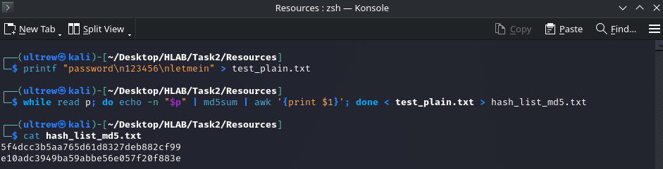
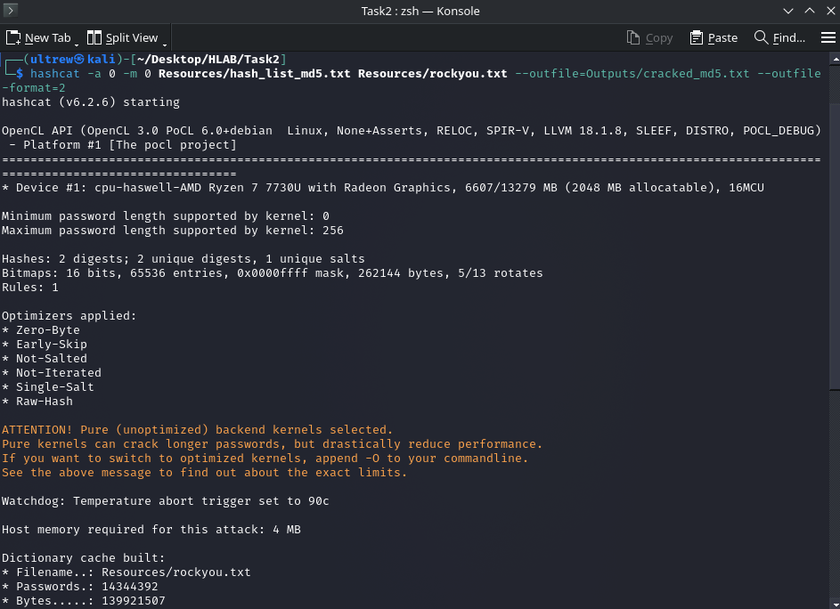
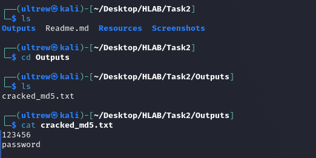
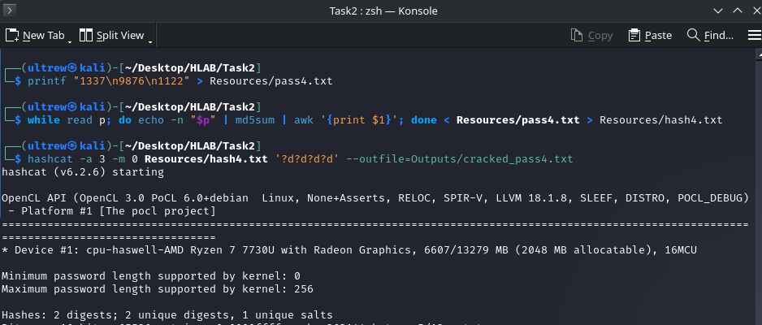
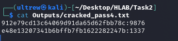

# Task 2 : Password Cracking with Hashcat 🧑‍💻

**My Name:** Tanishq Nama
**Internship:** Broskieshub.com
**My Objective:** I need to crack a given list of password hashes using dictionary and brute-force attacks. Afterwards, I'll document my methods, results, and what I recommend for mitigation in a formal report.

---

### **Phase 1: Setup & Preparation**

First things first, I need to get my environment ready. This means setting up my folders and getting my wordlists and hash files in place.

#### **Step 1: I Create My Workspace**
I'll start by creating a clean directory structure to keep all my files organized.

```bash
# I'll go to my home directory
cd ~

# Now, I'll create my project folders
mkdir -p Broskieshub/Task2/{Resources,Outputs,Screenshots}

# And I'll move into my new task directory to start working
cd Broskieshub/Task2
````

- `Resources/`: This is where I'll keep my input files, like hash lists and wordlists.
    
- `Outputs/`: I'll save my results here, like the list of cracked passwords.
    
- `Screenshots/`: All my evidence screenshots will go into this folder.

#### **Step 2: I Prepare My Wordlist**

I'm going to use `rockyou.txt`, a massive wordlist of common passwords that comes with Kali Linux. It's often compressed, so I need to extract it.

Bash

```
# This command will copy and unzip rockyou.txt directly into my Resources folder.
sudo gunzip -c /usr/share/wordlists/rockyou.txt.gz > Resources/rockyou.txt
```

#### **Step 3: I Prepare My Practice Hash List**

To make sure my setup is working, I'll create a small practice hash list first. A **hash** is just a one-way scramble of a password.

```bash
# 1. First, I create a file with a few simple passwords.
printf "password\n123456\nletmein" > test_plain.txt

# 2. Next, I'll convert them into MD5 hashes and save them to a new file.
while read p; do echo -n "$p" | md5sum | awk '{print $1}'; done < test_plain.txt > hash_list_md5.txt

# 3. Finally, I'll check my new hash list to make sure it looks right.
cat hash_list_md5.txt
```

Time for my first screenshot to show the contents of  my new `hash_list_md5.txt`.



> **Note:** For the main task, I'll place the _actual_ target hash file at `Resources/hash_list.txt`.

---

### **Phase 2: The Cracking Process** 💥

Now for the fun part. I'll run the attacks, starting with the most efficient methods.

#### **Method 1: The Dictionary Attack**

This attack tries every password from my `rockyou.txt` file. It's the best place to start because it quickly finds all the common, weak passwords.

**Command (for MD5 hashes):**

```bash
hashcat -a 0 -m 0 Resources/hash_list_md5.txt Resources/rockyou.txt --outfile=Outputs/cracked_md5.txt --outfile-format=2
```

- `-a 0`: This is **Attack Mode 0**, a simple dictionary attack.
    
- `-m 0`: This is **Hash Mode 0**, which is for standard MD5 hashes.
    
- `--outfile=...`: This tells Hashcat where to save the cracked passwords I find.
    
- `--outfile-format=2`: I'm using this to save the output as `hash:password`.

Now, I'll take my screenshots for evidence:

1. A shot of my terminal while Hashcat is running.
   


2. A shot showing the contents of my output file after the run is complete.

	  

#### **Method 2: The Mask (Brute-Force) Attack**

First, I'll create a file with passwords that are actually 4 digits long.

```bash
# 1. I'll create a file with a few 4-digit PINs.
printf "1337\n9876" > Resources/pass4.txt
```

Next, I'll convert these new 4-digit PINs into MD5 hashes.

```bash
# 2. This command converts the PINs into MD5 hashes.
while read p; do echo -n "$p" | md5sum | awk '{print $1}'; done < Resources/pass4.txt > Resources/hash4.txt
```

Now, I'll run the mask attack. Notice that the input file is now `Resources/hash4.txt` to match the file I just created.

```bash
# The mask '?d?d?d?d' now matches the 4-digit passwords I created.
hashcat -a 3 -m 0 Resources/hash4.txt '?d?d?d?d' --outfile=Outputs/cracked_pass4.txt
```

This command will now succeed because the passwords it's looking for (`1337`, `9876`, `1122`) are within the range of the mask (`0000`-`9999`).

Finally, to see the result, I'll use the `--show` command. This displays the cracked password that Hashcat automatically saved in its potfile (a file where it stores cracked hashes).

**Command:**
```bash
cat Outputs/cracked_pass4.txt
```

And that's the whole process! I've successfully created a hash for a 4-digit PIN, cracked it with a targeted mask attack, and viewed the final result.
Screenshot of my terminal while this attack is running.

- **Hashcat running:**



- **Cracked pass:** 



> **Warning:** I have to remember that brute-force is **very slow**. I should only use it for short, simple patterns.

---

### Summary 📝
#### Impact & Risk 📉

Cracked passwords pose a significant security risk. An attacker could use these credentials to gain **unauthorized access** to user accounts, which could lead to **data theft**, financial loss, **privilege escalation** within a network, or the ability to launch further attacks against the organization.

#### Root Cause 🔍

The primary root causes for these vulnerabilities are:

- The use of **weak, common, or easily guessable passwords** by users.
    
- The use of an outdated and **fast hashing algorithm (MD5)**, which is not resistant to modern cracking techniques.
    
- The lack of a strong **password policy** to enforce complexity and length.

#### My Recommendations ✅

To mitigate these risks, I recommend the following actions:

- **For Developers:** Stop using fast hashing algorithms like MD5. Instead, use a modern, slow, and salted hashing algorithm like **Argon2** or **bcrypt**.
    
- **For Administrators:** Enforce a strong password policy that requires a minimum length (e.g., 12+ characters), complexity (upper, lower, numbers, symbols), and prevents the use of common passwords.
    
- **For All Systems:** Implement **Multi-Factor Authentication (MFA)** wherever possible. MFA is the single most effective defense against password-based attacks, as it requires a second form of verification even if the password is stolen.

---
#### Interview Questions & Answers

1. **What is a hashing algorithm?** It's a one-way function that takes an input (like a password) and produces a fixed-length string of characters, known as a hash. It's designed to be irreversible, meaning you can't get the original password back from the hash.
    
2. **How does brute-force password cracking work?** It's an attack that systematically tries every possible combination of characters (letters, numbers, symbols) until it finds one that produces the same hash as the target.
    
3. **What is the difference between hashing and encryption?** **Hashing is a one-way process**; you can't reverse it. **Encryption is a two-way process**; data that is encrypted can be decrypted back to its original form using a key.
    
4. **What is salting in password hashing?** Salting is the process of adding a **unique, random value (the "salt")** to each password before it gets hashed. This ensures that even if two users have the same password, their stored hashes will be completely different, making pre-computed attacks like rainbow tables useless.
    
5. **What is a rainbow table?** It's a pre-computed lookup table used to quickly reverse cryptographic hashes. Attackers use it to find the plaintext password corresponding to a given hash, but it's only effective against unsalted hashes.
    
6. **Which tool is better: Hashcat or John the Ripper?** Neither is strictly "better"; they have different strengths. **Hashcat is known for its speed and GPU optimization**, making it extremely fast. **John the Ripper is very flexible and excels at auto-detecting hash types**. Both are essential tools in a security professional's toolkit.
    
7. **What is a dictionary attack?** It's an attack that uses a list of common words and phrases (a "dictionary" or wordlist) and tries each one as a password, hoping for a match. It's much faster than a brute-force attack if the user has a common password.
    
8. **Why are short passwords insecure?** They have a very small **keyspace** (the total number of possible combinations). This small number of possibilities makes it incredibly fast for a computer to try every single one in a brute-force attack.
    
9. **What is the function of rockyou.txt?** `rockyou.txt` is one of the most famous **password wordlists**. It contains millions of real-world passwords that were exposed in previous data breaches. Security professionals use it to test for weak, commonly used passwords in dictionary attacks.
    
10. **How do attackers obtain hashed passwords?** Attackers typically get them through **database breaches**, SQL injection attacks, misconfigured cloud storage, stolen system backups, or by gaining access to a server and dumping the password file (like `/etc/shadow` on Linux).

---
End of report.