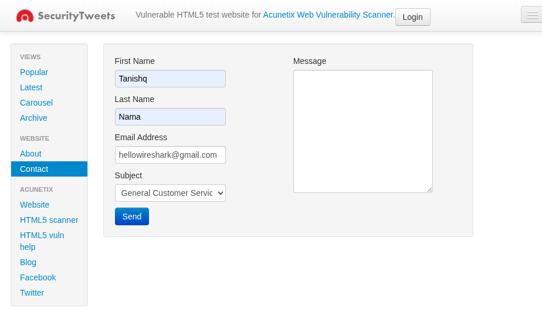
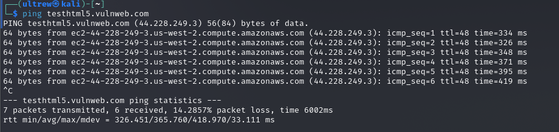
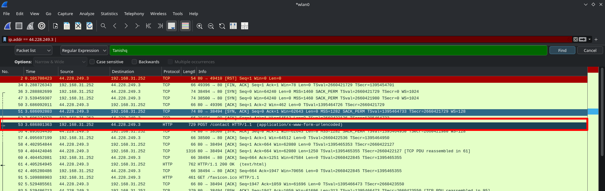
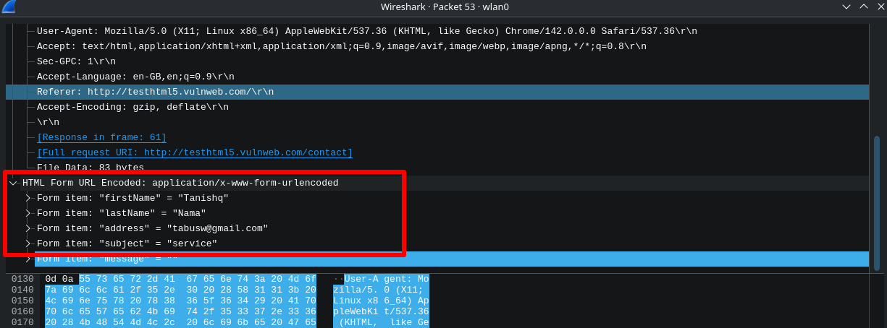

# Task-11 : Network Traffic Analyzer

## Internship at : Broskieshub.com

## Overview 
This project demonstrates live network traffic analysis using Wireshark to capture and identify plaintext data transmission across network packets. By analyzing HTTP traffic to a deliberately vulnerable test website, the project successfully captures and extracts user-submitted credentials and personal information transmitted over unencrypted connections. This practical exercise highlights critical security vulnerabilities in web applications that fail to implement HTTPS encryption and the real-world risks of data exposure during network transmission.

## Objective
- Capture live network traffic from web applications using Wireshark
- Apply advanced filtering techniques to isolate specific IP addresses and protocols
- Search captured packets for sensitive data and personal information
- Extract and analyze plaintext credentials transmitted over unencrypted connections
- Document security vulnerabilities and demonstrate the importance of encryption

## Tools
- **Primary Tool**: Wireshark - Network protocol analyzer for packet capture and inspection
- **Target Application**: SecurityTweets (testhtml5.vulnweb.com) - Deliberately vulnerable HTML5 web application
- **Analysis Method**: Real-time packet filtering and payload inspection
- **Output Format**: Screenshots and documented findings

## Deliverables
- PCAP file
- Evidence of personal information (usernames) as screenshots captured in network packets
- Readme.md report

## Practical Execution

### Step 1: Access Vulnerable Web Application and submit User Details via HTTP Form

**Action Taken**: Navigated to SecurityTweets contact form at `http://testhtml5.vulnweb.com/#/contact` and filled out and submitted contact form with personal information (username: "tanishq" and other details)

**Purpose**: This deliberately vulnerable application was chosen to safely demonstrate how unencrypted web applications expose data during transmission. The application intentionally uses HTTP (not HTTPS), making all transmitted data visible to network packet analyzers.

---

### Step 2: Identify Target IP Address

**Action Taken**: Performed IP lookup for `testhtml5.vulnweb.com` and identified the server IP address as `44.228.249.3`

**Purpose**: IP address identification is essential for filtering network traffic to analyze only packets associated with the target server, reducing noise in packet captures and focusing analysis on relevant communication.

 
---

### Step 3: Launch Wireshark and Apply IP Filter

**Action Taken**: 
1. Opened Wireshark to capture live network traffic
2. Started packet capture on active network interface
3. Applied filter: `ip.addr == 44.228.249.3`

**Purpose**: This filter isolates only packets traveling to or from the SecurityTweets server, removing unrelated network traffic and making analysis more focused. Using IP-based filtering is a critical technique in network forensics and security analysis.

**Filter Explanation**: 
- `ip.addr ==` matches packets where either source OR destination IP equals the specified address
- `44.228.249.3` is the SecurityTweets server
- Result: Only packets communicating with this specific server are displayed

---

### Step 4: Search for Personal Information in Packets

**Action Taken**: 
1. Used Wireshark's Find function (Ctrl+F or Edit → Find Packet)
2. Searched for the username "tanishq" in all captured packets
3. Located the packet containing the plaintext username

**Purpose**: This demonstrates how personally identifiable information (PII) can be extracted from network traffic when transmitted over unencrypted HTTP connections. Searching for specific strings in packet payloads is a key technique in incident response and security investigations.

**Critical Finding**: The username "tanishq" and all other info was found in plaintext within a captured packet, confirming that user-submitted data was transmitted without encryption.

---
## Security Analysis Findings

### Vulnerability Identified: Plaintext Transmission of User Data

**Severity**: CRITICAL

**Description**: The SecurityTweets application transmits user-submitted contact form data (including username "tanishq") over HTTP without encryption, making it visible to anyone capturing network traffic.

**Evidence**: 
- IP filter `44.228.249.3` isolated server traffic
- String search successfully located "tanishq" in packet payload
- Packet analysis showed unencrypted HTTP transmission
- Personal information visible in plaintext without decryption

**Attack Scenario**: An attacker on the same network (using tools like Wireshark or TCPDump) could easily:
1. Capture all traffic to the SecurityTweets server
2. Extract usernames, email addresses, and any submitted data
3. Build a database of user credentials and personal information
4. Use this data for social engineering, credential stuffing, or identity theft

**Real-World Impact**: This vulnerability demonstrates why major websites (Amazon, Gmail, Facebook, etc.) use HTTPS encryption for ALL interactions, not just login pages.

---
## Key Learning Outcomes
- **HTTP** transmits all data in plaintext, visible at packet level
- **HTTPS** encrypts the entire session using TLS/SSL, making payloads unreadable to eavesdroppers
- This project proved that even seemingly "safe" form submissions over HTTP expose personal information
- Learned to apply targeted filters (`ip.addr == X.X.X.X`) to reduce traffic noise
- Discovered how to search for specific strings within packet payloads
- Understood the complete packet structure from Ethernet through Application layers

---
## Recommendations
- **Implement HTTPS**: Encrypt ALL connections, not just login pages.
- **Use modern TLS**: Require TLS 1.2 or higher; disable HTTP entirely
- **Enable HSTS (HTTP Strict Transport Security)**: Force browsers to use HTTPS
-  **Never trust user input**: Validate and sanitize all submitted data
---
## Interview Questions
**1. Why was plaintext transmission of user data such a critical vulnerability?**

Plaintext transmission means any attacker on the same network segment can easily capture the data without sophisticated tools. Using basic packet analyzers like Wireshark, they can search for specific usernames and extract complete form submissions. This exposes the entire attack surface—usernames, emails, phone numbers, and any other submitted information can be harvested at scale. When credentials are transmitted in plaintext, attackers can immediately use them for account takeover.

**2. How does the IP filter `ip.addr == 44.228.249.3` help isolate relevant traffic?**

Network traffic includes thousands of packets from various sources (DNS queries, browser updates, cloud sync, etc.). By filtering to a specific IP address, we eliminate all irrelevant traffic and focus only on communication with the target server. This makes manual analysis feasible—instead of reviewing millions of packets, we examine only the relevant hundreds. It's a critical technique in forensic investigations where investigators need to prove specific devices communicated.

**3. What is the difference between searching for keywords and deep packet inspection?**

**Keyword searching** looks for specific strings anywhere in packets, useful for finding usernames, passwords, or known malware signatures. **Deep packet inspection (DPI)** analyzes protocol structure, payload content, and behavioral patterns to identify threats that may not match keywords. In this project, we used keyword searching to find "tanishq" which was effective because the data was in plaintext. DPI would additionally analyze whether the HTTP request structure was valid, detect malicious encoding, or identify evasion techniques.

**4. Why would an attacker use packet capture tools instead of direct server attacks?**

Packet capture is **passive reconnaissance**—the attacker captures data without alerting security systems or generating suspicious logs. Direct attacks on servers are logged, firewalled, and detected. Network-based attacks are harder to trace because the attacker may be on the same network segment (compromised Wi-Fi, shared corporate network, etc.). Additionally, packet capture reveals data from ALL users communicating with a server simultaneously, making it scalable for mass data theft.

**5. How would implementing HTTPS encryption have prevented this vulnerability?**

With HTTPS, the entire HTTP communication (including the username "tanishq" and form data) would be encrypted using TLS/SSL. Even if an attacker captured the exact same packets, the payload would be unreadable without the server's private key. The packet would show only encrypted ciphertext instead of plaintext data. Wireshark would display the packets but reveal no useful information about submitted usernames or form content.

**6. What other unencrypted protocols transmit credentials similarly?**

**FTP (File Transfer Protocol)**: Transmits usernames and passwords in plaintext on port 21. **Telnet**: Remote access protocol transmitting all commands in plaintext. **SMTP (Simple Mail Transfer Protocol)**: Email transmission and authentication in plaintext. **IRC (Internet Relay Chat)**: Chat messages in plaintext. **SNMP (Simple Network Management Protocol)**: Community strings (passwords) in plaintext. Modern alternatives (SFTP, SSH, SMTPS, Secure IMAP) encrypt these protocols to prevent credential exposure.

**7. How would you detect if credentials were being transmitted over HTTPS?**

HTTPS encryption is application-layer security—the TCP/IP packets still show the connection but payload is encrypted. You could detect HTTPS connections by:
- Observing port 443 (standard HTTPS port) instead of port 80
- Analyzing TLS handshake packets to identify encryption algorithms
- Using `tls` filter in Wireshark to view only encrypted sessions
- Examining certificate information from the TLS ClientHello and ServerHello

However, you **cannot extract credentials** from HTTPS traffic because the payload remains encrypted.

**8. What is a "man-in-the-middle" (MITM) attack and how does packet capture relate to it?**

A MITM attack occurs when an attacker intercepts communication between two parties by positioning themselves on the network path. Packet capture is the foundational technique—the attacker must be able to capture packets to execute MITM. In this project, we demonstrated the first step of MITM: capturing plaintext data. Advanced MITM could involve modifying packets, injecting malicious content, or redirecting traffic to attacker-controlled servers.

**9. How could someone intercept your packets on a shared Wi-Fi network?**

On unencrypted Wi-Fi, any connected device can put its network adapter in "promiscuous mode" to capture all traffic from all users. Tools like Wireshark and TCPDump make this trivial—no special privileges required beyond standard user access. An attacker on the same Wi-Fi network could capture:
- Usernames and passwords from HTTP logins
- Email contents transmitted without TLS
- Files transferred over unencrypted protocols
- Complete browsing history and visited websites

This is why using VPNs (Virtual Private Networks) on public Wi-Fi is critical—VPNs encrypt all traffic even on unencrypted networks.

**10. What role does network monitoring play in modern cybersecurity?**

Network monitoring through PCAP analysis provides **visibility** into what's actually happening on a network, beyond what firewalls and endpoint security report. It's critical for:
- **Incident response**: Reconstructing attacks by analyzing traffic patterns
- **Threat detection**: Identifying command-and-control communication, data exfiltration
- **Compliance**: Proving that data wasn't exfiltrated, supporting forensic requirements
- **Vulnerability validation**: Confirming that encryption is properly implemented
- **Breach investigation**: Determining what data was exposed and to whom

Regular network monitoring and PCAP retention policies are essential for modern security operations.

---
## Conclusion

This practical exercise successfully demonstrated how unencrypted web applications expose user data during network transmission. By capturing live traffic to a vulnerable test application, filtering to the target server's IP address, and searching packet payloads for personal information, we proved that the username "tanishq" and submitted form data were transmitted in readable plaintext without encryption.

The experiment validated critical security principles: **encryption is not optional for sensitive data transmission**, packet analysis tools provide complete visibility into unencrypted communications, and real-world attackers use these same techniques to compromise user accounts and steal personal information.

The findings highlight why modern security standards require HTTPS for all web traffic and demonstrate the effectiveness of network-based forensic analysis in security investigations.

---

End of report.
