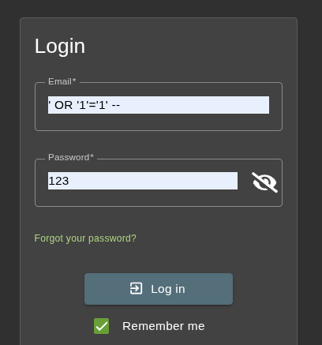
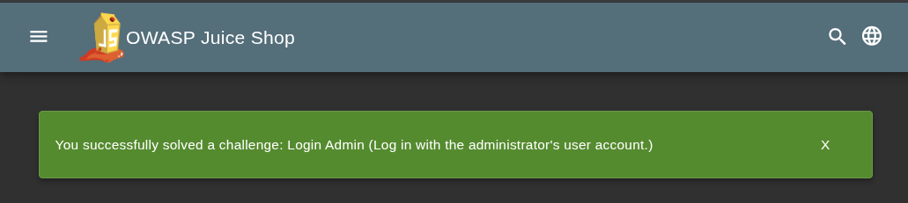
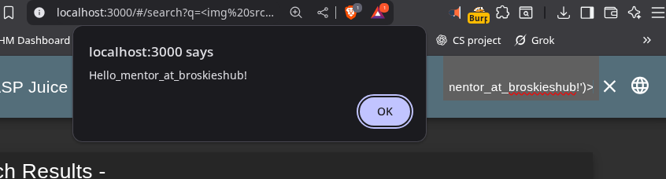

# Task 9 : Web Vulnerability Testing Using OWASP Juice Shop

## Internship at : Broskieshub.com
## Introduction
As part of my internship I tackled Task 9: testing for common web security vulnerabilities in OWASP Juice Shop, a deliberately insecure web app designed to teach the OWASP Top 10 risks. I used OWASP Juice Shop as the target, Burp Suite for intercepting requests, Browser Dev Tools for inspecting elements, and Kali Linux for a secure testing environment. My goal was to identify easy-to-spot issues like SQL Injection (SQLi), Cross-Site Scripting (XSS), and Insecure Direct Object References (IDOR), then document them with evidence.

## Setup
I set up the environment on my Kali Linux :
1. Installed Node.js : `sudo apt update && sudo apt install nodejs npm`.
2. Cloned the repo : `git clone https://github.com/juice-shop/juice-shop.git`.
3. Navigated to the directory: `cd juice-shop`.
4. Installed dependencies: `npm install`.
5. Started the app: `npm start`.
6. Accessed it at `http://localhost:3000` browser.
7. Launched Burp Suite Community Edition, configured  froxyproxy to 127.0.0.1:8080, and turned on Intercept.

## Testing Process and Findings
I focused on beginner-friendly vulns from the hints and OWASP Top 10. Here's what I found, step by step.

### 1. SQL Injection (SQLi) - Login Bypass
SQLi lets attackers inject malicious SQL to manipulate queries. I targeted the login form.

- Navigated to `/#/login`.
- In the username field, entered: `' OR '1'='1' --`.
- Used `123` as password  and submitted.
- Result: Logged in as admin without creds! Scoreboard updated with "Login Admin" challenge.

**Login form with the payload, successful redirect to dashboard with successful login banner:** 

This exposes broken authentication (A07:2021).

### 2. Cross-Site Scripting (XSS) - Reflected XSS in Search
XSS injects scripts into web pages viewed by others. I tested the search bar for reflected XSS.

- Went to the search bar on the homepage.
- Entered: ``.
- Submitted: the alert popped up immediately.

**Captures the alert box saying "XSS" :** 

This is a classic injection flaw (A03:2021), allowing potential session hijacking.

### 3. Broken Access Control - View All Baskets

Instead of IDOR, I found a simpler access control flaw where users see data they shouldn’t.

- Logged in as a regular user (via /register).
- Used burpsuit to spot my basket ID `/rest/basket/6`.
- Changed ID to 1 (another user’s basket).
- Forwarded: saw their basket items.
- Scoreboard marked "View Basket" challenge.

**Screenshot:**
- Mine basket (user id = 6)

- Basket of user id = 1

This breaks access control (A01:2021), leaking user data.

## Lessons Learned
Through this, I learned to spot and report vulns systematically: recon (browse app), test inputs, intercept/exploit (Burp/Dev Tools), and verify impact (score updates). Key OWASP Top 10 ties: Injection, XSS under A03; IDOR under A01.

---

## Interview Questions

1. **What is OWASP Top 10?** → A list of the ten most critical web application security risks.
    
2. **What is SQL injection?** → A code injection attack targeting databases via malicious SQL queries.
    
3. **What is XSS and how does it work?** → Cross-Site Scripting where attackers inject malicious scripts into web pages.
    
4. **What is input sanitization?** → Cleaning and validating user input to prevent malicious data.
    
5. **What tools help test web app security?** → Tools like Burp Suite, OWASP ZAP, Nikto, and Nessus.
    
6. **What is the difference between passive and active attacks?** → Passive observes traffic; active alters or injects data.
    
7. **How can login forms be made secure?** → By using HTTPS, hashing passwords, implementing MFA, and rate limiting.
    
8. **What is HTTPS and why is it important?** → Secure HTTP that encrypts data in transit for confidentiality and integrity.
    
9. **What are security headers?** → HTTP response headers that enhance security (e.g., CSP, HSTS, X-Frame-Options).
    
10. **How do you report vulnerabilities responsibly?** → By disclosing to the vendor via responsible channels, not public forums.

---
End of report.