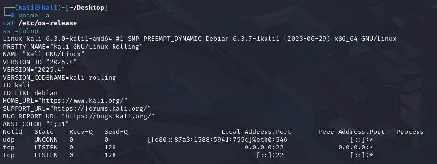
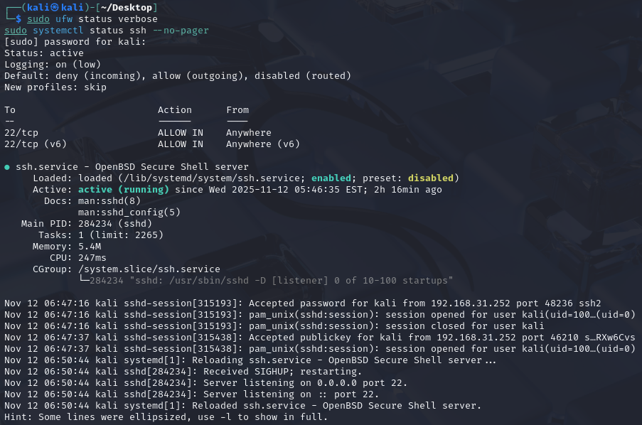
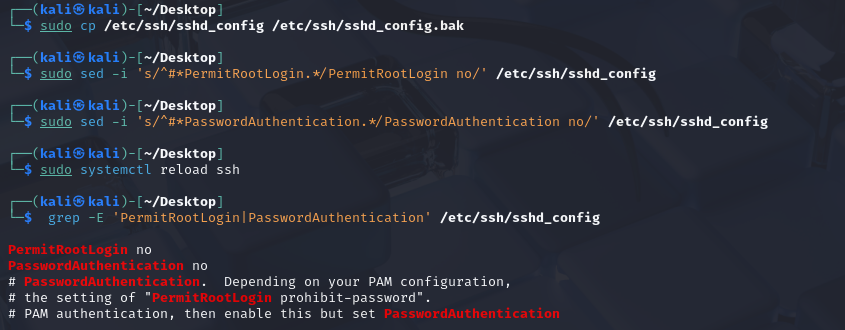
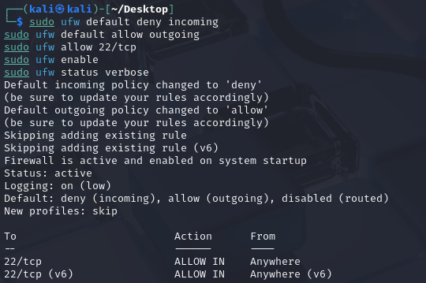
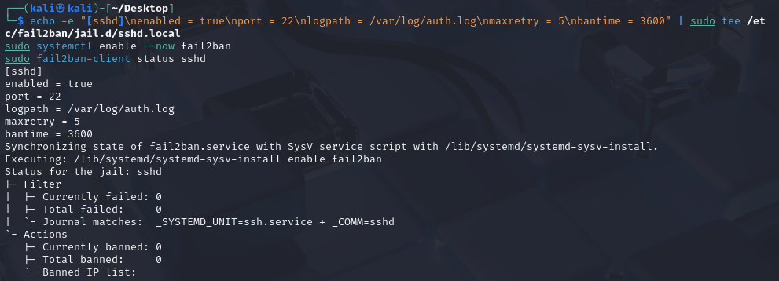
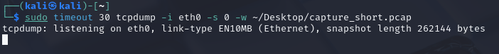
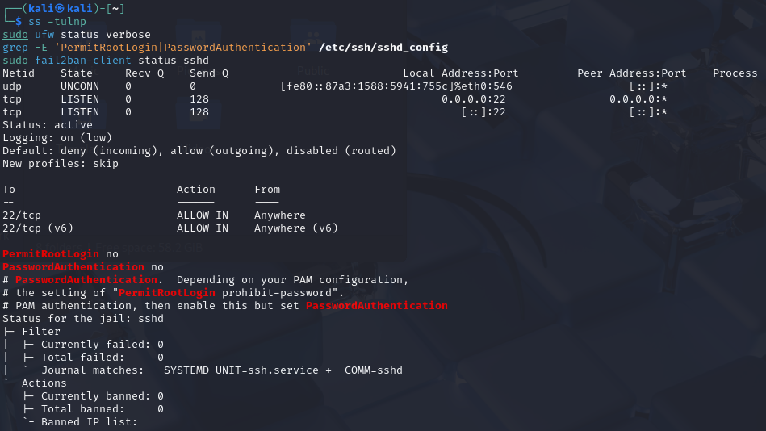

# Network Capture & Security Hardening in linux using UFW
### Internship at : broskieshub
## 🎯 Objective
Capture a short live network trace and secure the system by:
- Disabling root SSH login
- Enforcing key-based login (no passwords)
- Blocking unused ports using UFW
- Enabling fail2ban to block brute-force attempts

---

## 🧰 Tools Used
Ubuntu / Kali Linux, `ufw`, `fail2ban`, `tcpdump`, `ssh`

---

## ⚙️ Step 1: Check Current System State (Before)
Run these commands and save the outputs.

```bash
uname -a
cat /etc/os-release
ss -tulnp
sudo ufw status verbose
sudo systemctl status ssh --no-pager
```

-  Terminal showing open ports (`ss -tulnp`)



- Terminal showing firewall status (`ufw status verbose`)



---

## 🧩 Step 2: Install and Configure Tools

Install tools needed:
```bash
sudo apt update
sudo apt install -y ufw fail2ban tcpdump openssh-server
```

---

## 🔒 Step 3: Secure SSH
Backup and harden SSH configuration:
```bash
sudo cp /etc/ssh/sshd_config /etc/ssh/sshd_config.bak
sudo sed -i 's/^#*PermitRootLogin.*/PermitRootLogin no/' /etc/ssh/sshd_config
sudo sed -i 's/^#*PasswordAuthentication.*/PasswordAuthentication no/' /etc/ssh/sshd_config
sudo systemctl reload ssh
grep -E 'PermitRootLogin|PasswordAuthentication' /etc/ssh/sshd_config
```

- Terminal showing `PermitRootLogin no` and `PasswordAuthentication no`



---

## 🔥 Step 4: Configure UFW Firewall
Set up UFW to allow only SSH (and optionally HTTP/HTTPS):
```bash
sudo ufw default deny incoming
sudo ufw default allow outgoing
sudo ufw allow 22/tcp
sudo ufw enable
sudo ufw status verbose
```

- `ufw status verbose` showing firewall active and SSH allowed



---

## 🧱 Step 5: Configure Fail2ban
Add simple SSH protection:
```bash
echo -e "[sshd]\nenabled = true\nport = 22\nlogpath = /var/log/auth.log\nmaxretry = 5\nbantime = 3600" | sudo tee /etc/fail2ban/jail.d/sshd.local
sudo systemctl enable --now fail2ban
sudo fail2ban-client status sshd
```

- `fail2ban-client status sshd` showing the jail is enabled



---

## 📡 Step 6: Capture Live Network Traffic
Capture 30 seconds of live traffic:
```bash
sudo timeout 30 tcpdump -i eth0 -s 0 -w ~/capture_short.pcap
```
If you’re using Wi-Fi, replace `eth0` with `wlan0`.

-  Terminal showing `tcpdump` running and capturing packets



---

## 🧠 Step 7: Analyze Capture File
Checked for cleartext credentials or suspicious traffic but not find any since i did'nt performed any form step.

---

## ✅ Step 8: Check Final System State (After)
Run again to verify your hardening worked:
```bash
ss -tulnp
sudo ufw status verbose
grep -E 'PermitRootLogin|PasswordAuthentication' /etc/ssh/sshd_config
sudo fail2ban-client status sshd
```

- Combined view of secure SSH and firewall active



---

## 🧍‍♂️ Final Notes
- Always test SSH in another terminal before closing your main session.
- Only capture packets on authorized networks.
- Keep `.pcap` files private — they may contain sensitive info.

---
End of report.

